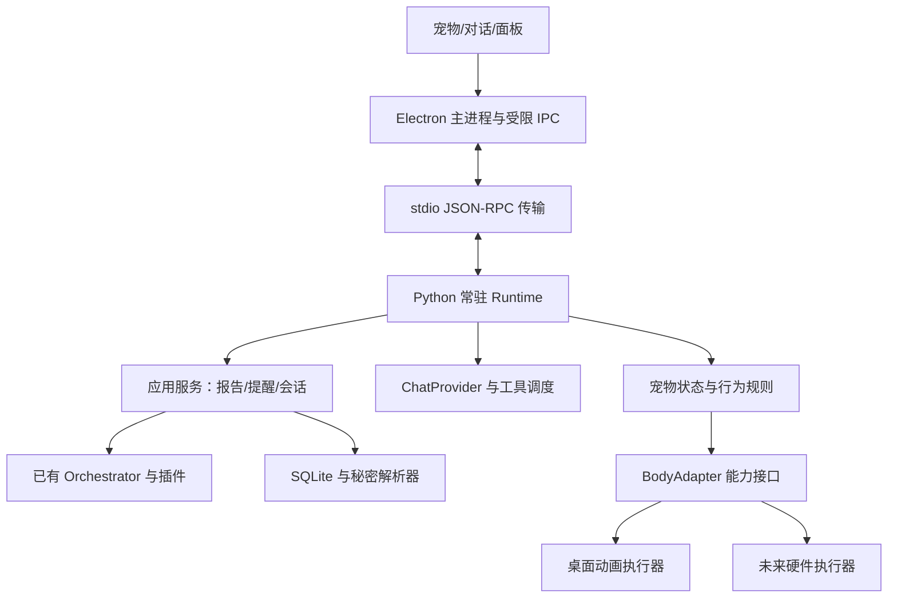

# Otter Desktop：系统设计与改造点

> 这是实施前的规划快照。当前已实现的功能和实际验证结果，以 [桌面说明](README.md) 与 [验证记录](VERIFICATION.md) 为准。

## 代码依据
已读取远端默认分支以下文件，未执行测试；README 中测试数量仅是项目声明。
- [pyproject.toml](https://github.com/MSzgy/otter/blob/main/pyproject.toml)：Python 3.11+，Typer、LangGraph、Pydantic、httpx，四类 entry_points；未配置桌面依赖。
- [cli.py](https://github.com/MSzgy/otter/blob/main/src/otter/cli.py)：配置、Store、Orchestrator 组装和 notifier 调用目前位于 CLI。
- [llm.py](https://github.com/MSzgy/otter/blob/main/src/otter/core/llm.py)：同步 generate(prompt, system)，没有多轮/工具/流式契约。
- [orchestrator.py](https://github.com/MSzgy/otter/blob/main/src/otter/core/orchestrator.py)：同步 graph.invoke；采集失败隔离；写完整 prompt/response 到 llm_traces。
- [store.py](https://github.com/MSzgy/otter/blob/main/src/otter/core/store.py)：SQLite WAL，实例持有单一连接。连接归属和并发写要显式管理。
- [paths.py](https://github.com/MSzgy/otter/blob/main/src/otter/core/paths.py)：基于 cwd 查项目根；打包启动需要新路径策略。

## 技术决策
首选 Electron + TypeScript + React（面板）+ Canvas（宠物），配合现有 Python 核心。Electron 主进程负责窗口、系统菜单栏、生命周期；渲染层不访问数据库、密钥和任意系统命令。先验证透明窗口、穿透、多屏和资源占用，再冻结框架。
Tauri 可作为资源占用不达标时的比较方案，但需额外 Rust/sidecar 与 macOS 窗口验证；Swift/AppKit 适合日后明确只服务 Mac 的深度原生需求。此处选择 Electron 是实现取舍，尚未跑性能基准。

## 架构

## 进程、接口与取消
开发阶段由 Electron 启动 uv/Python；发布阶段内置打包后的 Python 后台程序。stdin/stdout 使用有大小上限的逐行 JSON-RPC 2.0，stdout 禁止混入 Rich 和日志，日志走 stderr。主进程经 preload 暴露白名单方法，校验 IPC 来源与参数；contextIsolation、sandbox 开启，nodeIntegration 关闭，渲染 Markdown 时禁用任意 HTML/脚本。
先用 stdio 避免本地监听端口和认证配置；未来跨设备增加经认证的网络适配器，保持业务命令与事件不变。

建议命令：health.get、reports.list/get/generate、jobs.get、chat.send/cancel、reminders.create/update/delete/list、pet.interact、settings.get/update。长任务立即返回 job_id；进度事件用 job.progress/job.finished/job.failed。流式用 chat.delta/chat.done/chat.failed。传输通知包含 protocol_version、event_id、seq、session_id、turn_id、时间与 payload；重连先获取状态快照，不重放过期动画。

宠物动作具有 action_id、kind、duration_ms、ttl_ms、priority。优先级：停止/中断 > 用户交互 > 明确提醒 > 任务状态 > 待机动作。重试按 ID 去重，待机动作可丢弃，禁止无限排队。
对话取消传播到 provider、语音与动画，并过滤过期 turn_id。同步旧 provider 暂以后台任务桥接，可停止展示但不能宣称已取消上游计费请求；新 ChatProvider 才提供原生流式与取消能力。已经提交数据库的提醒不会因取消对话而自动撤销。

## 应用层与已有 CLI
新增 application 服务，提取 CLI 的配置组装、报告调用和通知管线。CLI 和 Runtime 共同调用服务，桌面不解析终端输出。已有批处理图继续负责采集/简报；聊天和宠物采用独立会话逻辑与状态机，长报告不能阻塞 UI 或语音。
阻塞图运行在受控后台 worker，Store 在使用它的线程内创建/关闭。SQLite 写入采用短事务、busy_timeout 和应用级任务去重；WAL 不能解决共享连接跨线程和重复报告写同一文件的问题。同一天的生成任务设互斥键，文件先写临时文件再原子替换。桌面上线时迁移与常驻实例加锁，并提示用户处理旧外部定时任务，避免两个调度器重复生成。

## 模型与记忆
保留旧 LLMProvider.generate，新增可选 ChatProvider 协议：多轮消息、文本流、结构化工具请求、取消、能力声明。复用配置与 secret resolver，旧插件不被强制实现新协议。工具首批为查简报、查工作事件、提醒增查改删、待办；天气在有可用数据源后接入。
工作上下文查询带日期/来源并限制条数和大小，回答附来源；采集内容是数据，不是执行指令。角色设定、近期会话、用户显式保存偏好分开。长期记忆早期不引入向量库。

## 数据与配置
新增 conversations、messages、reminders、preferences、jobs、delivery_records；使用仓库现有顺序 SQL 迁移机制，具体编号实施时取下一可用编号。
提醒持久化 UTC due_at 与原始时区、request_id、status、delivery_id。周期提醒延后，若支持则单独定义本地时区和夏令时规则。到期先原子认领 delivery，再投递并记录结果；崩溃边界不宣称严格 exactly-once，恢复后结合 delivery_id 和客户端去重减少重复。
唤醒后按提醒类别/过期时长补报并合并，不把积压提醒连续朗读。Mac 退出/睡眠不保证实时触发。报告、任务和消息持久化，动画与短暂宠物状态可丢弃。
桌面数据使用 ~/Library/Application Support/Otter，日志使用 ~/Library/Logs/Otter。开发与旧 CLI 保留显式 --config/OTTER_PROJECT_ROOT；已有路径迁移提供预览、备份和导入，不静默改变数据位置。打包模板/SQL 用包资源读取，不依赖仓库 cwd。打包后的 Python 必须保留 entry_points 元数据与内建插件；第三方插件安装方式单独验证，首版发布包只承诺已打包的插件。

## 宠物与系统行为
2D 动画按统一资源 manifest 定义状态、帧率、循环和过渡，逻辑与美术分开。简易占位水獭即可验收，之后换精细素材。动画在本地执行，待机不调用模型。透明区域不会自动穿透，需命中检测配合窗口 API，且拖拽区域与点击区域要分开。
主进程维护单实例和子进程心跳；后端异常采用有限重启并显示离线。正常退出先停止接收请求、保存状态、关闭连接，超时再结束子进程，避免孤儿进程。菜单栏驻留与退出语义明确。
按键语音阶段新增 AudioInput/Output、ASR/TTS 适配器；先单工再做回声和自动打断。音频传输另用有上限、可清理的临时文件/二进制通道，不把无限音频 base64 塞入控制流。

## 硬件演进
BodyAdapter 提供 capabilities、express、perform、stop、输入事件。桌面把 nod 映射成动画，硬件把 nod 映射成已标定的限幅动作。没有移动/舵机能力时降级表情。第一阶段只实现 DesktopBody 和 MockBody，第二阶段用 Mac 当大脑经 USB 串口驱动 ESP32；第三阶段才迁移 Linux Runtime。
迁移到树莓派需要替换 macOS Keychain、通知、路径及平台采集器。Mac 本地 Git/Outlook 数据不会自动出现在树莓派；可先继续由 Mac 采集，通过显式认证接口提供有限上下文。协议复用不等于所有平台功能无修改迁移。

## 参考
- https://www.electronjs.org/docs/latest/tutorial/custom-window-styles
- https://www.electronjs.org/docs/latest/tutorial/custom-window-interactions
- https://www.electronjs.org/docs/latest/tutorial/security
- https://v2.tauri.app/reference/config/
